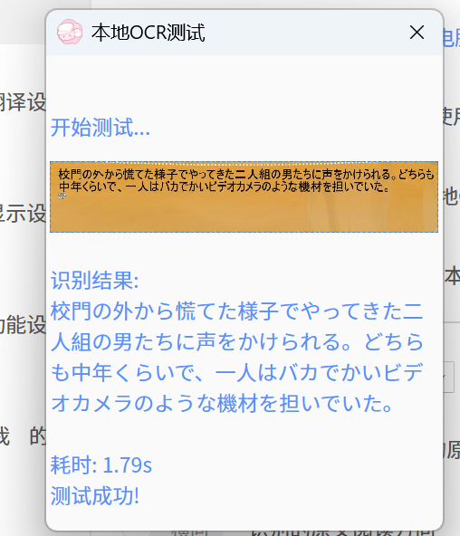

在团子翻译器（https://translator.dango.cloud/ ）的本地OCR功能上 ，支持大模型视觉模型识别

效果会比常规ocr更好！

# 如何使用

1.复制.env.example，到.env

2.修改.env里面的参数 

3.执行python脚本 app_pak.py，会输出exe到团子翻译器安装目录

# 效果图：

# 如何查看运行日志

去翻译器安装目录，logs/ocr.log

# 模型选择

一般选择Pro/Qwen/Qwen2.5-VL-7B-Instruct就够用了，也可以选择哈基米2.5 flash。